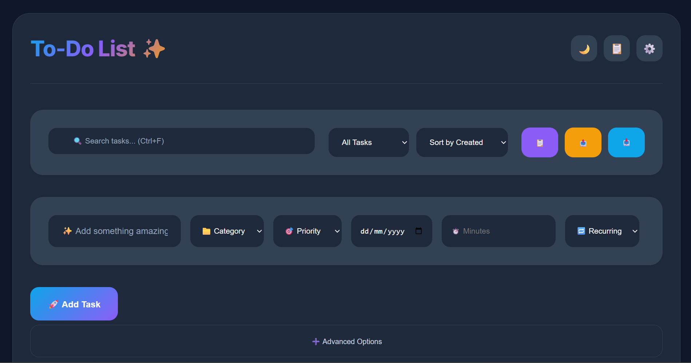
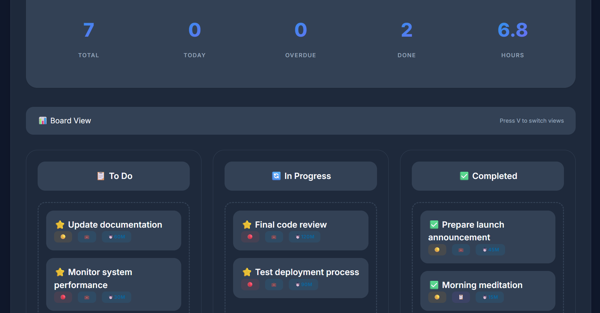

# CODINGSAMURAI
# 🌟 Professional Joyful To-Do List

A modern, feature-rich task management application built with vanilla JavaScript, offering professional productivity features with a delightful user experience.




## ✨ Features

### 🎯 Core Task Management
- **Smart Task Creation** - Quick add with categories, priorities, and due dates
- **Rich Task Details** - Notes, attachments, time estimates, and custom tags
- **Subtasks** - Break down complex tasks into manageable steps
- **Recurring Tasks** - Automatic task recreation (daily, weekly, monthly, yearly)
- **Multiple Categories** - Work, Personal, Shopping, Health, Home, and Other
- **Priority Levels** - High, Medium, and Low priority with visual indicators

### 🔍 Advanced Organization
- **Powerful Search** - Find tasks by text, category, tags, or notes
- **Smart Filtering** - View by status, date, category, or completion
- **Multiple Sort Options** - By priority, due date, creation time, or alphabetical
- **Dual View Modes** - List view and Kanban board view
- **Quick Stats Dashboard** - Overview of total, today's, overdue, and completed tasks

### 🎨 User Experience
- **Dark/Light Themes** - Eye-friendly design for any lighting condition
- **Responsive Design** - Perfect on desktop, tablet, and mobile devices
- **Drag & Drop** - Reorder tasks and move between board columns
- **Keyboard Shortcuts** - Power user efficiency with comprehensive hotkeys
- **Real-time Notifications** - Browser notifications for due and overdue tasks
- **Celebration Animations** - Confetti effects for completed tasks

### 📱 Progressive Web App (PWA)
- **Offline Capability** - Works without internet connection
- **App Installation** - Install directly to desktop or mobile home screen
- **Fast Loading** - Service worker caching for instant startup
- **Native Feel** - App-like experience across all platforms

### 🔧 Professional Tools
- **Task Templates** - Pre-built templates for common workflows
- **Import/Export** - JSON-based data portability
- **Data Persistence** - Automatic saving to browser storage
- **File Attachments** - Associate files with tasks (up to 5MB each)
- **Rich Text Notes** - Markdown-style formatting in task descriptions

## 🚀 Quick Start

### Installation

1. **Clone the repository:**
   ```bash
   git clone https://github.com/yourusername/professional-todo-list.git
   cd professional-todo-list
   ```

2. **Serve the files:**
   ```bash
   # Using Python 3
   python -m http.server 8000
   
   # Using Node.js (with serve package)
   npx serve .
   
   # Using any local server of your choice
   ```

3. **Open in browser:**
   ```
   http://localhost:8000
   ```

### No Build Process Required!
This application runs entirely in the browser with no build tools, dependencies, or compilation needed.

## 📖 Usage Guide

### Basic Operations

**Adding a Task:**
1. Type your task in the main input field
2. Select category and priority
3. Optionally set due date and time estimate
4. Click "🚀 Add Task" or press Enter

**Advanced Task Creation:**
1. Click "➕ Advanced Options" for expanded features
2. Add detailed notes with formatting toolbar
3. Attach files using the file picker
4. Add custom tags with # prefix
5. Set recurring schedule if needed

**Managing Tasks:**
- **Complete:** Click the ⭐ icon next to any task
- **Edit:** Click the ✏️ edit button to modify task details
- **Delete:** Click the 🗑️ delete button to remove tasks
- **Add Subtasks:** Click the 📝 button to break down complex tasks

### Keyboard Shortcuts

| Shortcut | Action |
|----------|--------|
| `Ctrl+N` | Focus on new task input |
| `Ctrl+F` | Focus on search |
| `Ctrl+E` | Export tasks |
| `Ctrl+I` | Import tasks |
| `Ctrl+A` | Select all visible tasks |
| `V` | Toggle between list and board view |
| `T` | Toggle dark/light theme |
| `?` | Show keyboard shortcuts help |
| `Esc` | Close modals and clear selection |
| `Delete` | Delete selected tasks |

### View Modes

**List View:**
- Traditional task list with full details
- Perfect for detailed task management
- Shows all task metadata and notes

**Board View (Kanban):**
- Visual workflow management
- Drag tasks between "To Do", "In Progress", and "Completed"
- Great for project management workflows

### Task Templates

Pre-built templates for common scenarios:
- **🌅 Daily Routine** - Morning tasks and habits
- **🚀 Project Launch** - Complete project checklist
- **📊 Weekly Review** - Planning and review tasks

Access templates via the 📋 button in the controls bar.

## 🏗️ Technical Details

### Architecture

**Frontend-Only Application:**
- Pure vanilla JavaScript (ES6+)
- Modern CSS with custom properties
- No external dependencies or frameworks
- Progressive Web App capabilities

**Data Storage:**
- Browser localStorage for persistence
- JSON-based data format
- Automatic saving on all changes
- Import/export for data portability

**Performance Features:**
- Efficient DOM manipulation
- Minimal reflows and repaints
- Optimized animations with CSS transforms
- Service worker caching for fast loading

### Browser Support

- **Modern Browsers:** Chrome 80+, Firefox 75+, Safari 13+, Edge 80+
- **PWA Features:** Supported in Chrome, Edge, and Safari
- **Mobile:** iOS Safari 13+, Chrome Mobile 80+

### File Structure

```
professional-todo-list/
├── index.html          # Main HTML structure
├── app.js             # Application logic and features
├── styles.css         # Modern styling and themes
├── manifest.json      # PWA manifest
├── sw.js             # Service worker (for PWA)
├── icons/            # App icons for PWA
└── README.md         # This file
```

## 🎨 Customization

### Themes
The application includes both dark and light themes with smooth transitions. Themes can be toggled via:
- The 🌙/☀️ button in the header
- The `T` keyboard shortcut
- Automatic persistence of user preference

### CSS Custom Properties
Easy customization through CSS variables:
```css
:root {
    --primary-500: #0ea5e9;    /* Primary color */
    --secondary-500: #8b5cf6;  /* Secondary color */
    --accent-500: #f59e0b;     /* Accent color */
    /* ... more customizable properties */
}
```

### Task Categories
Add new categories by modifying the category options in both `index.html` and the corresponding CSS styles.

## 🔒 Privacy & Security

- **Local Storage Only** - All data stays on your device
- **No Analytics** - No tracking or data collection
- **No Network Requests** - Works completely offline
- **File Upload Safety** - Files processed locally, 5MB limit per file

## 🛠️ Development

### Local Development
1. Make changes to HTML, CSS, or JavaScript files
2. Refresh browser to see changes
3. No build process required

### Adding Features
The modular architecture makes it easy to extend:
- **New Task Properties** - Add to task object structure
- **Additional Views** - Implement in the rendering system
- **Extra Filters** - Extend the filtering logic
- **More Templates** - Add to the templates object

### PWA Development
To modify PWA features:
1. Update `manifest.json` for app metadata
2. Modify `sw.js` for caching strategies
3. Add new icons to the icons directory

## 📱 Progressive Web App

### Installation
Users can install the app:
1. **Desktop:** Click install prompt or "Install App" button
2. **Mobile:** Use browser's "Add to Home Screen" feature
3. **Automatic:** App will prompt for installation when criteria are met

### Offline Features
- Full functionality without internet
- Data persistence across sessions
- Cached resources for fast loading
- Background sync capabilities

## 🤝 Contributing

We welcome contributions! Here's how you can help:

1. **Fork the repository**
2. **Create a feature branch:** `git checkout -b feature/amazing-feature`
3. **Make your changes** and test thoroughly
4. **Commit changes:** `git commit -m 'Add amazing feature'`
5. **Push to branch:** `git push origin feature/amazing-feature`
6. **Open a Pull Request**

### Development Guidelines
- Follow existing code style and conventions
- Test across different browsers and devices
- Ensure accessibility compliance
- Update documentation for new features
- Keep the no-dependency principle

### Bug Reports
Please include:
- Browser and version
- Steps to reproduce
- Expected vs actual behavior
- Screenshots if applicable

## 📄 License

This project is licensed under the MIT License - see the [LICENSE](LICENSE) file for details.

## 🙏 Acknowledgments

- Built with modern web standards and best practices
- Inspired by productivity methodologies like GTD and Kanban
- Designed for both casual users and productivity enthusiasts
- Icon system uses Unicode emojis for universal compatibility

## 🔮 Roadmap

Future enhancements being considered:
- **Cloud Sync** - Optional cloud storage integration
- **Team Collaboration** - Shared task lists and assignments
- **Advanced Analytics** - Productivity insights and reports
- **Calendar Integration** - Sync with external calendar systems
- **Advanced Recurring** - More complex recurrence patterns
- **Task Dependencies** - Link related tasks together

---

**Made with ❤️ for productivity enthusiasts everywhere!**

*For questions, feedback, or support, please open an issue on GitHub.*